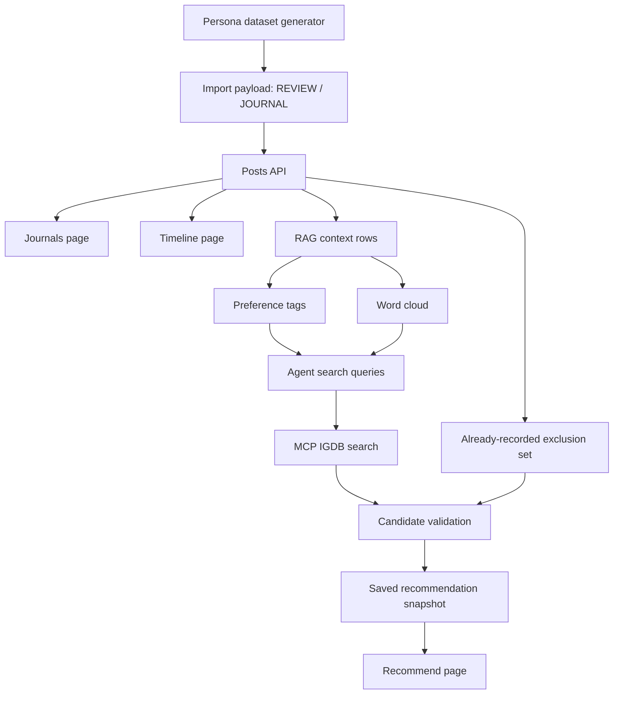

# codex/gjc-active-sprint-priority-fixes 현재 브랜치 학습 노트

## 1. 정리 범위

- 기준 범위: `main..HEAD`
- 현재 브랜치: `codex/gjc-active-sprint-priority-fixes`
- 핵심 변경 축:
  - 플레이어 선호도 IGDB 기반 합성 데이터셋 추가
  - 저널/리뷰 목록 API 연동과 페이지네이션 계약 고정
  - 타임라인 필터, 더보기, 상세 이동 흐름 정리
  - RAG 취향 분석의 사용자 범위 격리와 태그/워드클라우드 분리
  - AI 추천 Agent의 후보 검증, 제외 목록, 한국어 추천 근거 강화
  - 추천 화면의 저장 스냅샷 복원, 명시적 동기화, 반응형 레이아웃 개선

이 노트는 현재 브랜치에서 남긴 주석과 테스트, QA 메모, 변경 파일을 함께 읽고 “왜 이렇게 구현했는지”를 학습 관점으로 재구성한 것이다.

## 2. 데이터셋 설계: 페르소나별 취향 신호를 만들기

`docs/datasets/player-preference-igdb/generate-player-preference-dataset.mjs`는 네 가지 테스트 페르소나를 만든다.

- RPG/시뮬레이션 솔로 성향: 40건
- 퍼즐 솔로 성향: 80건
- 멀티플레이어 소셜 성향: 20건
- 호러/분위기 성향: 20건

데이터셋은 리뷰와 저널을 섞어서 만든다. 생성 규칙은 세 번째 항목마다 `JOURNAL`, 나머지는 `REVIEW`가 되도록 배치되어 있다. 이 덕분에 한 페르소나 안에서도 평점이 있는 리뷰 신호와 자유 서술형 저널 신호가 함께 존재한다.

주석에서 특히 중요한 부분은 `GJC-173`이다. 리뷰 평점은 UI에서 쓰는 0.5 단위 별점과 맞추기 위해 반 별점 단위만 허용한다. 테스트 데이터가 실제 입력 UI의 제약과 다르면 추천/RAG 테스트는 통과해도 운영 화면에서는 다른 문제가 생길 수 있다. 그래서 생성기 단계에서부터 UI 스케일을 따라가도록 고정했다.

또 하나의 설계 포인트는 IGDB 숫자 ID를 비워두고 `lookupQuery`, `slug`, `sourceUrl` 같은 단서를 남긴 점이다. 현재 데이터셋은 오프라인으로 재생성 가능해야 하므로, 외부 API 상태에 따라 결과가 흔들리는 직접 조회를 생성 단계에 넣지 않는다. 대신 나중에 import나 보강 작업에서 IGDB 후보를 찾을 수 있는 힌트를 보존한다.

## 3. Posts/Journals API 계약: 화면 편의보다 서버 계약을 먼저 고정하기

`client/src/pages/Journals.tsx`는 리뷰와 저널을 같은 `/posts` API에서 가져오되, 쿼리 조건은 분리한다.

- 리뷰 목록: `type=REVIEW&mine=true`
- 저널 목록: `type=JOURNAL&mine=true`
- 검색어: `q`
- 정렬, 페이지, 페이지 크기: URL 쿼리와 API 쿼리에 함께 반영

주석에서 `searchInput`과 `searchQuery`를 분리한 이유가 중요하다. 사용자가 키를 입력할 때마다 API 요청을 보내면 목록 화면이 불안정해지고 서버 호출도 늘어난다. 입력 상태는 로컬에 두고, 실제 API 검색어는 검색 실행이나 디바운스 이후에만 갱신한다.

리뷰와 저널의 페이지네이션 전략도 다르다. 리뷰는 로그 성격이 강해서 정렬과 페이지 이동 중심이고, 저널은 페이지 번호 창을 제공한다. `GJC-174` 주석은 모바일에서도 페이지 번호가 과도하게 늘어나지 않도록 작은 페이지 창을 둔 이유를 설명한다.

`server/src/posts/posts.service.spec.ts`의 `GJC-182` 테스트는 목록 API의 기본 페이지 계약을 고정한다. 3번 페르소나 `MULTIPLAYER_TEST`는 저널이 7건인데, 기본 `limit`이 10이므로 `GET /posts?type=JOURNAL&mine=true`의 첫 페이지에 모두 들어와야 한다. 이 테스트는 “데이터는 있는데 화면에서 일부만 보이는” 문제를 서버 계약 차원에서 막는다.

## 4. 타임라인 흐름: 한 API로 섞어 보여주고, 상세 경로만 분기하기

`client/src/pages/Timeline.tsx`는 리뷰와 저널을 하나의 타임라인으로 보여준다. 필터는 `ALL`, `REVIEW`, `JOURNAL` 세 가지이며, `ALL`일 때는 `type` 쿼리를 보내지 않는다.

주석에서 확인되는 구현 원칙은 다음과 같다.

- `URLSearchParams`로 쿼리를 만들고 `?`, `&` 조합 실수를 피한다.
- 더보기는 다음 페이지를 요청한 뒤 기존 카드 배열에 append한다.
- append 시에는 post id 기준으로 중복을 제거한다.
- 상세 이동은 게시글 타입에 따라 `/review-detail/:id` 또는 `/journal-detail/:id`로 나눈다.
- `Link`의 state에 `{ from: '/timeline' }`을 넣어 상세 화면의 뒤로가기/삭제 후 이동이 목록 페이지가 아니라 타임라인으로 돌아오게 한다.

`GJC-140` 주석은 더보기 페이지를 붙일 때 id 기준 dedupe가 필요한 이유를 말해준다. 서버 페이지가 바뀌거나 새 글이 끼어드는 상황에서도 같은 카드가 중복 렌더링되지 않게 하기 위한 방어다.

## 5. RAG 분석: 현재 사용자 신호만 쓰고, 태그와 플레이 스타일을 분리하기

`server/src/ai/rag.service.ts`의 핵심은 RAG 입력 범위를 현재 사용자로 제한하는 것이다. `buildPreferenceQuery` 주석은 다른 플레이어의 기록이 현재 사용자의 취향 분석에 섞이면 안 된다는 점을 명확히 한다.

분석 흐름은 다음과 같다.

1. 현재 사용자의 `ArchivePost`와 `UserGame` 기록을 가져온다.
2. 필요하면 archive embedding을 갱신한다.
3. 현재 사용자 기록으로 preference query를 만든다.
4. OpenAI embedding을 만들거나, 키가 없거나 실패하면 demo hash embedding으로 fallback한다.
5. pgvector 검색 결과와 `UserGame` 컨텍스트를 합친다.
6. OpenAI 분석 또는 fallback 분석으로 `preferenceTags`와 `wordCloud`를 만든다.

여기서 중요한 학습 포인트는 `preferenceTags`와 `wordCloud`의 역할 분리다.

- `preferenceTags`: 사용자가 좋아하는 게임 요소, 장르, 시스템
- `wordCloud`: 사용자의 플레이 방식, 행동 패턴, 감상 태도

예를 들어 `CRAFTING`은 게임 요소 태그가 될 수 있고, `HUNTING_LOOP`나 `AESTHETIC_EXPLORER`는 플레이 스타일 단어가 될 수 있다. `server/src/ai/rag.service.spec.ts`는 두 레이어가 서로 중복되지 않는지 확인한다.

`GJC-180` 주석은 퍼즐 취향을 하나의 `PUZZLE`로 뭉개지 않는 이유를 설명한다. 퍼즐 중심 사용자는 `LOGIC_PUZZLE`, `PUZZLE_SYSTEMS`, `RULE_MANIPULATION`처럼 세부 취향이 추천 품질을 크게 좌우한다. fallback 분석에서도 이 세분화를 유지해야 MCP 검색과 추천 근거가 더 정확해진다.

## 6. Agent 추천: 많이 가져오는 것이 아니라 믿을 만한 후보만 남기기

`server/src/ai/agent.service.ts`의 추천 동기화는 RAG 분석 결과를 바탕으로 MCP `search_games`를 호출하고, 후보를 검증한 뒤 저장 가능한 추천 목록을 만든다.

핵심 주석과 상수는 다음 의도를 가진다.

- `MIN_RECOMMENDATION_COUNT = 6`: 사용자가 top 3만 보는 것이 아니라 비교할 수 있는 카드 수를 보장한다.
- `MAX_RECOMMENDATIONS_PER_SERIES = 1`: 같은 시리즈가 추천 목록을 독점하지 않게 한다.
- `DEFAULT_AGENT_MAX_ITERATIONS = 4`: Agent 반복 호출이 무한정 늘어나지 않게 한다.
- `DEFAULT_AGENT_TIMEOUT_MS = 30000`: 추천 동기화가 화면을 오래 붙잡지 않게 한다.

`GJC-181` 주석이 있는 `hasReliableCandidateMatch`는 추천 품질의 핵심 방어선이다. title 기반 검색은 이름, 별칭, slug가 충분히 맞아야 하고, tag 기반 검색은 장르, 태그, 요약 같은 메타데이터가 취향 태그를 뒷받침해야 한다. 그래서 `Opus Magnum`을 이미 기록한 사용자에게 다시 추천하지 않고, `Magnum Opus`처럼 이름만 비슷한 저신뢰 후보도 걸러낸다.

또한 `loadRecommendationExclusionSet`은 현재 사용자의 `ArchivePost`와 `UserGame`에서 이미 기록한 게임의 id, IGDB id, Steam id, title을 모아 제외 목록을 만든다. 이 로직은 “추천은 새로워야 한다”는 제품 요구를 데이터베이스 쿼리로 보장한다.

MCP나 외부 검색 후보가 부족하면 `loadUserScopedLocalGames`가 현재 사용자 신호에 기반한 로컬 후보를 fallback으로 제공한다. `server/src/ai/agent.service.spec.ts`는 이 fallback이 다른 사용자의 데이터로 확장되지 않고, SQL 조건에 현재 `userId`가 들어가는지 확인한다.

## 7. 추천 화면: 저장된 결과는 복원하고, 새 분석은 명시적으로 실행하기

`client/src/pages/Recommend.tsx`는 페이지 진입 시 최신 추천 스냅샷만 복원한다. 주석에서 말하듯 페이지를 열었다고 AI 분석을 자동 실행하지 않는다. 새 RAG/MCP/Agent 파이프라인은 사용자가 `SYNC`를 눌렀을 때만 돈다.

이 방식의 장점은 세 가지다.

- 페이지 새로고침이 비용이 큰 AI 분석을 반복하지 않는다.
- 사용자는 마지막 추천 결과를 안정적으로 다시 볼 수 있다.
- 새 분석이 필요한 순간을 사용자의 명시적 행동으로 제한한다.

동기화 요청에는 request id 카운터가 붙는다. 사용자가 `SYNC`를 빠르게 여러 번 눌러도 마지막 응답만 화면 상태를 바꾼다. 비동기 응답 순서가 뒤집혀 오래된 결과가 최신 결과를 덮는 문제를 막는 패턴이다.

레이아웃 주석도 학습 가치가 있다. `GJC-179`는 워드클라우드 단어가 절대 위치로 겹치지 않고 일반 문서 흐름 안에서 강조만 달라지게 한다. `GJC-180`은 분석 태그가 6개를 넘어도 줄바꿈으로 자연스럽게 흐르도록 한다. 추천 카드도 긴 AI 근거 문장이 생길 수 있으므로 섹션 내부 스크롤 대신 페이지 흐름 안에서 세로로 확장되게 했다.

## 8. QA 메모와 테스트가 고정한 회귀 방지 포인트

현재 브랜치의 QA 메모는 단순 확인 기록이 아니라 “앞으로 깨지면 안 되는 흐름”을 문서화한다.

- `GJC-70_JOURNALS_API_INTEGRATION_QA_MEMO.md`: 저널/리뷰 목록이 mock 배열이 아니라 `/posts` API에서 온다는 점을 확인한다.
- `GJC-77_TIMELINE_FLOW_QA_MEMO.md`: ALL/REVIEWS/JOURNALS 필터, 더보기, 상세 이동 경로를 확인한다.
- `GJC-182_PERSONA_JOURNAL_QA_MEMO.md`: 3번 페르소나의 7개 저널이 기본 목록 페이지에 모두 보여야 한다는 계약을 기록한다.

테스트는 다음 회귀를 막는다.

- 이미 기록한 게임을 추천하지 않는다.
- 이름만 비슷한 IGDB 후보를 추천하지 않는다.
- 메타데이터가 빈약한 후보를 추천하지 않는다.
- 최신 추천 스냅샷 조회는 새 sync를 실행하지 않는다.
- RAG fallback은 게임 요소 태그와 플레이 스타일 단어를 분리한다.
- 목록 API는 기본 페이지네이션과 `canEdit` 같은 화면 계약을 유지한다.

## 9. 전체 흐름 요약

## 10. 이번 브랜치에서 배운 구현 원칙

1. 테스트 데이터도 UI 제약을 따라야 한다. 반 별점 단위처럼 작은 제약이 나중에 import와 QA 신뢰도를 좌우한다.
2. 목록 화면은 API 계약을 먼저 고정해야 한다. 프론트에서 임시로 보정하면 페르소나 QA 같은 케이스가 다시 깨질 수 있다.
3. RAG는 컨텍스트 범위가 품질이다. 현재 사용자 기록만 분석해야 개인화 추천이라고 부를 수 있다.
4. 취향 태그와 플레이 스타일 단어는 다르게 써야 한다. 추천 검색에는 게임 요소가, 설명과 시각화에는 행동 패턴이 더 잘 맞는다.
5. 추천 후보는 많이 모으는 것보다 잘 거르는 것이 중요하다. 제외 목록, 시리즈 제한, 신뢰도 검증이 추천 품질을 만든다.
6. AI sync는 명시적이어야 한다. 페이지 진입은 저장 결과 복원, 버튼 클릭은 새 분석 실행으로 역할을 나누면 비용과 UX를 함께 제어할 수 있다.
7. 반응형 UI에서는 absolute 배치보다 문서 흐름이 더 안전하다. 태그, 워드클라우드, 긴 추천 근거는 줄바꿈과 세로 확장을 전제로 설계해야 한다.

## 11. 제외하거나 축약한 내용

- 생성된 대량 JSON/JSONL/CSV 데이터 파일은 레코드 단위로 모두 읽지 않고, 생성기와 summary/test account 구조 중심으로 해석했다.
- 기존 학습 노트 파일의 문장은 그대로 반복하지 않고, 현재 브랜치 변경 파일과 주석을 기준으로 재구성했다.
- QA 메모 일부는 터미널 출력 인코딩이 깨져 보였으나, 파일명, 코드 블록, 테스트/검증 의도, 관련 구현 파일을 기준으로 의미를 확인했다.
